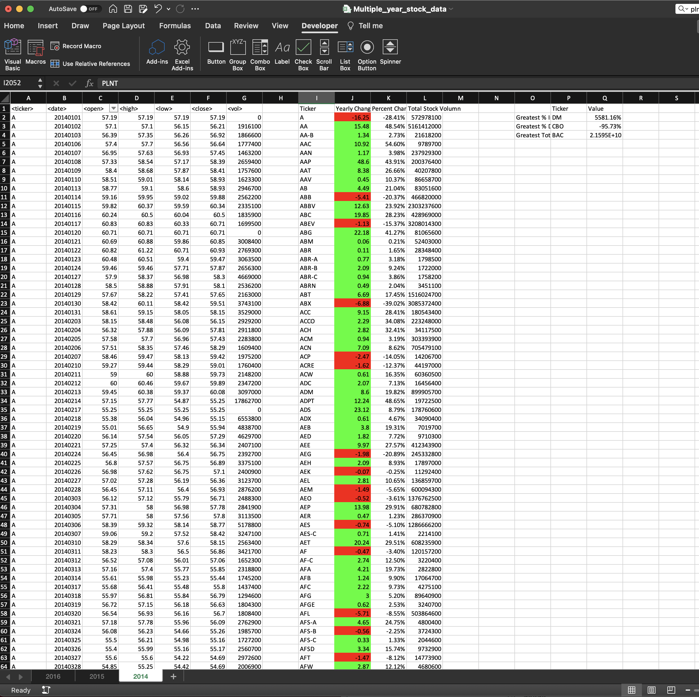
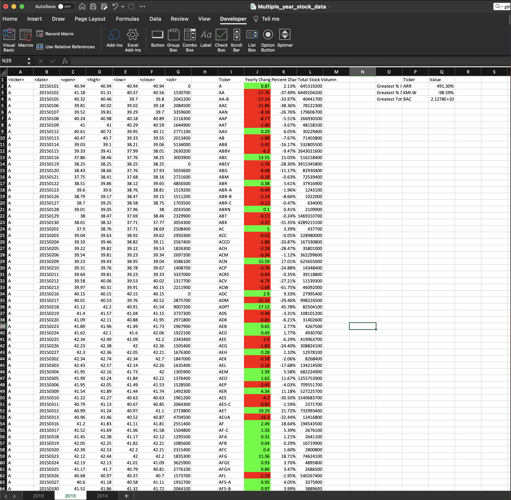
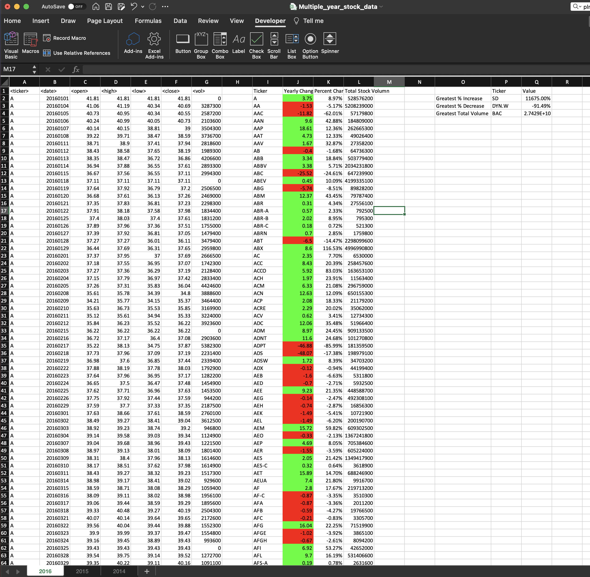

# VBA Homework - The VBA of Wall Street

## Background

You are well on your way to becoming a programmer and Excel master! In this homework assignment you will use VBA scripting to analyze real stock market data. Depending on your comfort level with VBA, you may choose to challenge yourself with a few of the challenge tasks.

### Before You Begin

1. Create a new repository for this project called `VBA-challenge`. **Do not add this homework to an existing repository**.

2. Inside the new repository that you just created, add any VBA files you use for this assignment. These will be the main scripts to run for each analysis.

### Files

* [Test Data](Resources/alphabetical_testing.xlsx) - Use this while developing your scripts.

* [Stock Data](Resources/Multiple_year_stock_data.xlsx) - Run your scripts on this data to generate the final homework report.

### Stock market analyst
* stock market analysis in 2014

* stock market analysis in 2015

* stock market analysis in 2016

## Rubric

[Unit 2 Rubric - VBA Homework - The VBA of Wall Street](https://docs.google.com/document/d/1OjDM3nyioVQ6nJkqeYlUK7SxQ3WZQvvV3T9MHCbnoWk/edit?usp=sharing)

- - -

© 2021 Trilogy Education Services, LLC, a 2U, Inc. brand. Confidential and Proprietary. All Rights Reserved.
